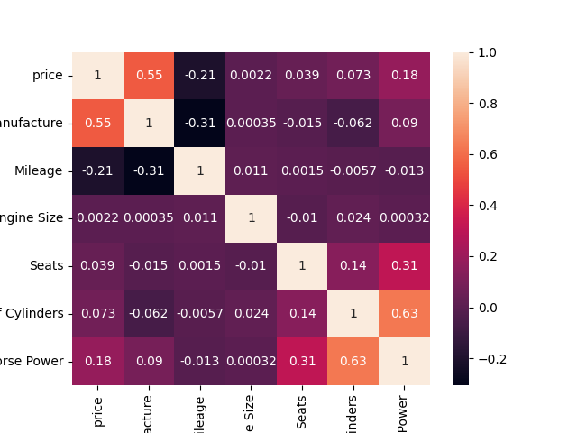

# Second-Hand Cars' Price Prediction

## Project Objectives
This project aims to predict the prices of second-hand cars in Nigeria using machine learning techniques. The project will involve building and evaluating different regression models, including linear regression, decision tree regression, and random forest regression. The models will be trained on a dataset containing information about the make, model, year, mileage, and other relevant features of a large number of second-hand cars sold in the Nigerian market. The project objective is to achieve high accuracy in predicting the prices of second-hand cars based on these features, which can help buyers and sellers make more informed decisions and improve overall market efficiency in Nigeria.


## Project Structure
- `assets/` - Holds plot images obtained during the study.
- `datasets/` - Holds the dataset used in the study.
- `production/` - Holds Django files that enables prediction in a live environment
- `production/artifcats/` - Holds contents of the compiled model.
- `production/templates` - Holds html files used in the web environment.
- `production/static` - Holds CSS files used in the web environment.
- `production/RequestHandler` - Holds files that interface with the prediction functions.


## Generating model artifacts
To run the notebook, you need to have Visual Studio Code or Jupyter Notebook installed on your computer. On Visual Studio Code, use the `Jupyter` extension from Marketplace to power up a kernel.

### Installing dependencies
The following packages are required to run the notebook:

- pandas
- matplotlib
- sklearn
- keras

You can install all of the required packages by running the following command in your terminal:

```sh
pip install -r requirements.txt
```

## Collecting metrics
The performance of each model was evaluated using the AccuracyScore metric. The higher the score, the better the model's performance.

The following figures show the actual exchange rates vs. predicted exchange rates for each model:

- Relationship across variables:


Server Log:


In a browser window, open the specified address (http://127.0.0.1:8000), specify the model to be used for prediction and passing the value to be predicted for


And there you have a successful prediction!

## Conclusion
Overall, the best model for predicting the car prices was the Decision Tree model (ANN) model, with a R2 score of 96.66%. The Random Forest (SVM) model had a R2 score of 95.50%, while the linear regression model had a a R2 score of 78.92%
